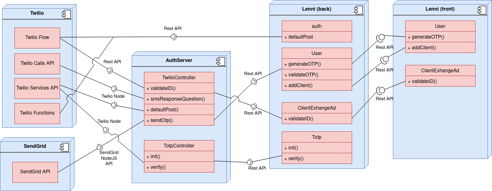

# Projet 4 - Documentation technique

Ce document a pour objectif de présenter le fonctionnement technique du projet dans le but de pouvoir le déployer dans n'importe quelle autre application. Vous trouverez les informations détaillées sur les requis, fonctionnalités et étapes menées dans ce projet dans le rapport de fin de session. Il est recommandé de le lire avant de continuer la lecture de cette documentation technique.

## Architecture
Ce projet est composé de quatre parties distinctes : Twilio, auth-server, Lenni Back, Lenni Front. Le diagramme suivant nous présente les différentes composantes technique que nous avons intégré dans chaque système.



Nous verrons dans cette section le rôle et le fonctionnement de chacune des parties.

### Twilio
Twilio est le service permettant principalement l'échange de SMS et d'appels. Nous utilisons plusieurs fonctionnalités de ce service:
- API Verify pour effectuer la gestion des codes TOTP
- Twilio Functions afin de pouvoir exécuter du code javascript directement dans Twilio
- Twilio Flows pour simplifier le processus de communication avec l'usager
Le fonctionnement de ces trois fonctionnalités dans le cadre de notre projet sont [détaillés ici](./documentation/twilio-functions.md).


### Auth-server
Auth-server est le serveur NodeJS que nous avons ajouté au projet. Il se charge principalement d'établir une communication entre Lenni Back et Twilio. Son fonctionnement est [détaillé ici](./documentation/auth-server.md).


### Lenni Back
Le backend de Lenni-App contient toute la logique de l'application. Nous y avons fait quelque modification pour ajouter la logique pour les différentes méthodes d'authentification possible. Il permet également de faire le pont entre le frontend de l'application avec 'Auth-server' pour certaine fonction. Les changements effectués sont [détaillé ici](./documentation/backend.md).

### Lenni Front
Le frontend de Lenni-App contient l'interface des différents utilisateurs de l'application (client, fournisseur et administrateur). Comme pour le backend, nous avons ajouter quelques méthodes pour ajouter la logique de nos différentes méthodes d'authentification dans l'interface. Les changements effectués sont [détaillé ici](./documentation/frontend.md).

## Déploiement du projet
Plusieurs étapes préliminaire sont nécessaire afin de déployer le projet.
Tout d'abord il est nécessaire d'avoir à sa disposition:
- Une instance MongoDB
- Un compte Twilio (paiement requis)
- Un compte SendGrid

### Déployer Lenni-App
Lenni-app est conteneurisé dans un conteneur Docker. Docker va exposer le port 5000 pour le serveur *auth-server* , 8081 pour le *backend*, 3000 pour le *frontend* et 80 pour *nginx*. Il est possible de changer les ports dans le fichier docker-compose.yml. 
Pour rouler le code:
- cd lenni-app
- cd docker-compose up --build -d

Nous pouvons accéder à l'application sur notre navigateur avec :
- http://localhost/admin (pour l'administrateur)
- http://localhost/signin (pour le client ou le fournisseur)

### Déployer Twilio
Pour déployer Twilio, nous avons nécessairement besoin d'un compte Twilio et télécharger 'ngrok'. Lorsque nous avons les deux, nous pouvons suivre les étapes suivantes :

- À partir du terminal ngrok, faire la commande : ```ngrok http 80```.
- Copier le lien obtenu dans la section *Forwarding* associé a *localhost:80* (lien se terminant par .ngrok.io).
- Accéder au Studio à partir de votre compte Twilio : 
    *Explore Products* --> Section *Developer tools* --> *Studio*.
- Coller le lien ngrok dans la Section :
    *Functions and Assets* --> *Functions (Classic)* --> *Configure* --> Changer la 'Value' de ```NGROKAUTH``` et ```NGROKLENNI```.

**NB**: Twilio et Lenni-App doivent tous les deux rouler pour que l'application fonctionne.

### Variables d'environnement
Afin que le projet soit déployé correctement, il faut ajouter un fichier ```.env``` a la racine des dossiers du backend et auth-server avec les clés suivantes.

#### Pour authserver
```
TWILIO_ACCOUNT_SID=XXX
TWILIO_AUTH_TOKEN=XXX
NGROK_CALLBACK=https://XXX.ngrok.io/authserver/twilio/question
TWILIO_SERVICE_SID=XXX
SENDGRID_API_KEY=XXX
``` 

#### Pour le backend
```
MONGO_URI='mongodb+srv://user_pi4:XXX.mongodb.net/?retryWrites=true&w=majority'
JWTSECRET='thisIsTheSecretToken'
JWTEXPIRATION='43200'
``` 

