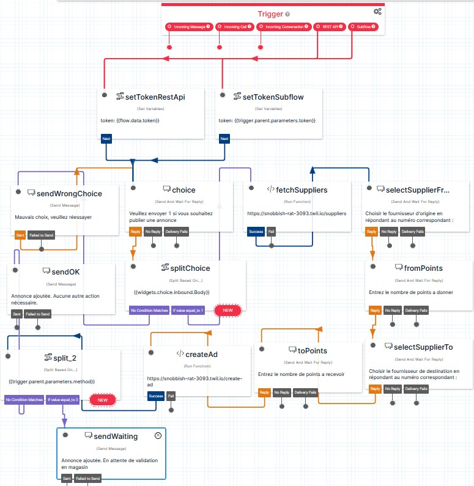

# Fonctions et Flow Twilio

Ce projet utilise le serice Twilio Functions qui nous permet d'éxecuter du code dans l'environnement de Twilio (notamment le flow).

Cette documentation détaillera l'ensemble des fonctions utilisées.

Si le projet est déployé dans un nouveau compte Twilio, il sera nécessaire de créer des fonctions pour chaque bloc de code énoncé ci bas.

## Flow

Avant d'aborder les fonction, voici quelques précisions concernant les flows.

- Twilio Flows permet d'automatiser des conversations text et d'intégrer des entrées de l'utilisateur dans les fonctions javascript décrites plus haut.

- Lenni Flow est le flow principal de notre application, il contient quatre sous-flows que nous avons créer afin de fournir une visualisation plus concise de notre logique d'application tel qu'illustré dans la capture suivante.


- Auth by password est le flow qui gère le premier facteur de l'authentification, tout d'abord l'utilisateur rentre son identifiant et mot de passe, le flow vérifie s'il y a une correspondance de ce tuple avec la base de données et donne l'accès au deuxième facteur si c'est le cas.


- TOTP est le flow effectuant la validation du code à usage unique temporel (TOTP). Tout d'abord on récupère l'identifiant de l'utilisateur qui a déjà valider son premier facteur. Ensuite on appelle la fonction totpValidate décrite plus haut qui lance le challenge pour valider le deuxième facteur.


- OTP est le flow effectuant la validation du code à usage unique (OTP). Tout d'abord on récupère l'identifiant de l'utilisateur qui a déjà valider son premier facteur. Ensuite on appelle la fonction getUserOTP qui vérifie la correspondance de l'entrée de l'utilisateur que l'on encrypte, puis que l'on compare avec la version déjà cryptée de la liste présente dans la base de données.


- Ads est le flow effectuant la gestion de la publication d'annonce de points sur l'application Lenni. On commence par choisir si on fait ou non une annonce, si c'est le cas on récupère la liste des fournisseurs. Ensuite on demande avec quel fournisseur l'usager souhaite faire un échange de points, et le nombre de poins à envoyer, ainsi que le nombre de points à recevoir.




Tout ces flows ont étés exportés sous format JSON pour être disponible pour un prochain usager. Voir le dossier ```documentation/flows```


## Configuration
Il est important d'utiliser la configuration suivante (notamment au niveau des variable d'environnement et des versions des librairies utilisées).


## API Verify
API Verify est une librairie offerte par Twilio, on l'utilise afin d'effectuer la gestion des codes TOTP, on l'utilise dans deux fonctions via auth-server tel qu'explicité dans la documentation de ce serveur. On utilise également ce service dans la fonction javascript totpValidate présente dans la plateforme Twilio qui elle, sert à faire l'authentification en tant que telle. Le fonctionnement de cette librairie dans le cas de TOTP est qu'on crée une entitée (la personne) et un facteur de type TOTP dans la fonction init de totp.controller.js. Ensuite, la vérification que la mise en place du facteur est fait dans la fonction verify se trouvant également dans totp.controller.js qui va ensuite subir des challenges (tentatives d'authentification) via la fonction totpValidate présente dans le flow de la plateforme Twilio. Les fonctions présentes dans le flow seront présentées plus bas.


## Split credentials :
- /split-credentials est utilisé pour séparer le nom d'utilisateur et son mot de passe de la saisie de son premier facteur.
```
exports.handler = function(context, event, callback) {

  let credentials = event.body.split(":");
  let response = { username: credentials[0], password: credentials[1] };
  
  callback(null, response);
};

```

## Get All Ads :
- /get-all-ads est utilisé pour faire un appel à node-server afin de récupérer toutes les annonces existantes.
```
const request = require("request");

exports.handler = function(context, event, callback) {
    const ngrok = context.NGROKLENNI || "Missing NGROK! :'(";
   request.get({
              url: ngrok+'/nodeserver/api/clientAd/transaction/all',
              headers: {
                'Content-Type': 'application/json',
                'x-auth-token': event.token
              },
          }, (error, response, body) => {
              callback(null, JSON.parse(response.body));
          }
    )
};
```

## Create Ads :
- /create-ad est utilisé pour faire un appel à node-server afin de créer une annonce d'échange de point.
```
const request = require("request");

exports.handler = function(context, event, callback) {
    const suppliersIdString = event.suppliers.split(", s")[1];
    const suppliersIdContent1 = suppliersIdString.split("[")[1];
    const suppliersIdContent2 = suppliersIdContent1.split("]")[0];
    const suppliersId = suppliersIdContent2.split(", ");
    let dataToSend = {
          "_id": "",
          "sellerID": "",
          "sellerUsername": "",
          "supplierFromID": suppliersId[event.fromSupplier],
          "supplierFromName": "",
          "pointsFrom": event.fromPoints,
          "supplierToID": suppliersId[event.toSupplier],
          "supplierToName": "",
          "pointsTo": event.toPoints,
          "timestamp": "2022-11-10T03:39:17.902Z"
        }
   request.post({
              url: context.NGROKLENNI + '/nodeserver/api/clientAd/exchange',
              headers: {
                'Content-Type': 'application/json',
                'x-auth-token': event.token
              },
              json: dataToSend
          }, (error, response, body) =>{
              callback(null, response.body);
          }
    )
};
```

## TOTP Validate :
- /totpValidate est utilisé pour valider l'authentification d'un usager via son code à usage unique temporel, Verify permet ainsi de faire la vérification que le code fournit par l'usager est identique au au code géner par Twilio suite à la synchronisation entre la plateforme de Twilio et l'appareil fournis au client après son inscription.
```
exports.handler = async function(context, event, callback) {
    const service_sid = context.SERVICE_SID // context.SERVICE_SID // || "Missing SERVICE_SID! :'("; VA3ef996873c16607d0d3760631dffb322
    const userId = event.userId;
    // const twilioClient = context.getTwilioClient();
    twilioClient = new Twilio("AC63c6c7e26a5d4e66e8808b4f05e8b42a", "5783ff4139fb25c8873483d3ee8c69a1")
    const factors = await twilioClient.verify.v2.services(service_sid)
        .entities(userId)
        .factors
        .list({pagesize: 500})
        .catch(e => {
            console.log(e)
            return callback(e)
            })
    const check = await twilioClient.verify.v2.services(service_sid)
    .entities(userId)
    .challenges
    .create({
        authPayload: event.code,//context.code,
        factorSid: factors[factors.length-1].sid
        })
        .catch(e => {
      console.log(e)
      return callback(e)
    });
    const response = new Twilio.Response();
    response.setStatusCode(200);
    response.appendHeader('Content-Type', 'application/json');
    response.setBody(check);
    
    return callback(null, response);
}; 
```

## Fetch User ID :
- /fetchChoice est utilisé pour faire un appel à node-server afin de récupérer le choix effectué par l'utilisateur sur son deuxième facteur d'athentification afin de guider la suite du flow.

```
const request = require("request");
exports.handler = function(context, event, callback) {
    const ngrok = context.NGROKLENNI || "Missing NGROK! :'(";
    request.get({
        url: ngrok+"/nodeserver/api/user/current",
        headers: {
            'Content-Type': 'application/json',
            'x-auth-token': event.token
        },
    }, (error, response, body) =>{
        var choiceNumber = JSON.parse(response.body).payload.userInfo.secondAuthChoice;
        callback(null,
            {method: choiceNumber});
    })
};
```

## Get User OTP :
- /getUserOTP est utilisé pour faire un appel à node-server afin de récupérer le prochain code à usage unique de la liste de l'utilisateur.
```
const request = require("request");
exports.handler = function(context, event, callback) {
    const ngrok = context.NGROKLENNI || "Missing NGROK! :'(";
    request.post({
        url: ngrok+"/nodeserver/api/user/verifyOTP",
        headers: {
            'Content-Type': 'application/json',
            'x-auth-token': event.token,
        },
        json: {"code": event.code}
        
    }, (error, response, body) =>{
        callback(null, body.has_errors);
        
    })
    
};

```

## Fetch Suppliers :
- /fetchSupplier est utilisé pour faire un appel à node-server afin de récupérer les fournisseurs associés aux points de l'utilisateur.
```
const request = require("request");
exports.handler = function(context, event, callback) {
    const ngrok = context.NGROKLENNI || "Missing NGROK! :'(";
    request.get({
        url: ngrok+"/nodeserver/api/user/points",
        headers: {
            'Content-Type': 'application/json',
            'x-auth-token': event.token
        },
    }, (error, response, body) =>{
        const payload = JSON.parse(response.body).payload
        let suppliers = ""
        let suppliersId = []
        for (let i = 0; i < payload.length; i++) {
            suppliers += (i + " : " + payload[i].supplier + " | ")
            suppliersId[i] = payload[i].supplierID
        }
        callback(null, {"suppliers" : suppliers, "suppliersId": suppliersId});
    })
};
```

## Security Question :
- /securityQuestion est utilisé pour faire un appel à auth-server afin de récupérer la question de sécurité associée à l'utilisateur en question.
```
const request = require("request");
exports.handler = function(context, event, callback) {
    const ngrok = context.NGROKLENNI || "Missing NGROK! :'(";
    request.post({
        url: ngrok+"/authserver/twilio",
        //cache: 'no-cache', // *default, no-cache, reload, force-cache, only-if-cached
        headers: {
            'Content-Type': 'application/json',
        },
        json: {
            'token': event.token 
        }
    }, (error, response, body) =>{
        callback(null, response)
    })
};
```

## Fetch Choice :
- /fetchChoice est utilisé pour faire un appel à node-server afin de récupérer le choix effectué par l'utilisateur sur son deuxième facteur d'athentification afin de guider la suite du flow.
```
const request = require("request");
exports.handler = function(context, event, callback) {
    const ngrok = context.NGROKLENNI || "Missing NGROK! :'(";
    request.get({
        url: ngrok+"/nodeserver/api/user/current",
        //cache: 'no-cache', // *default, no-cache, reload, force-cache, only-if-cached
        headers: {
            'Content-Type': 'application/json',
            'x-auth-token': event.token
        },
    }, (error, response, body) =>{
        var choiceNumber = JSON.parse(response.body).payload.userInfo.secondAuthChoice;
        callback(null,
            {method: choiceNumber});
    })
};
```

## Question :
- /question est utilisé pour faire un appel à node-server afin de récupérer la réponse et la question de sécurité de l'utilisateur.
```
const request = require("request");
exports.handler = function(context, event, callback) {
    const ngrok = context.NGROKLENNI || "Missing NGROK! :'(";
    request.get({
        url: ngrok+"/nodeserver/api/user/current",
        //cache: 'no-cache', // *default, no-cache, reload, force-cache, only-if-cached
        headers: {
            'Content-Type': 'application/json',
            'x-auth-token': event.token
        },
    }, (error, response, body) =>{
        var questionNumber = JSON.parse(response.body).payload.userInfo.question;
        var question;
        switch(question){
                  case 1: question = 'Quel est votre film favori ?'; break;
                  case 2: question = 'Dans quelle ville êtes vous né ?'; break;
                  case 3: question = 'Quelle était votre école secondaire ?'; break;
                  case 4: question = 'Quel est le nom de jeune fille de votre mère ?';
              }

        callback(null,
            {
                question: JSON.parse(response.body).payload.userInfo.question,
            answer: JSON.parse(response.body).payload.userInfo.answer});
    })
};
```

## Fetch User ID :
- /fetchUserID est utilisé pour faire un appel à node-server afin de récupérer son identifiant dans le but de faire le premier facteur d'authentification.
```
const request = require("request");
exports.handler = function(context, event, callback) {
    console.log(event)
    const ngrok = context.NGROKLENNI || "Missing NGROK! :'(";
    request.get({
        url: ngrok+"/nodeserver/api/user/current",
        headers: {
            'Content-Type': 'application/json',
            'x-auth-token': event.token
        },
    }, (error, response, body) =>{
        callback(null, JSON.parse(response.body).payload.clientId);
    })
};
```